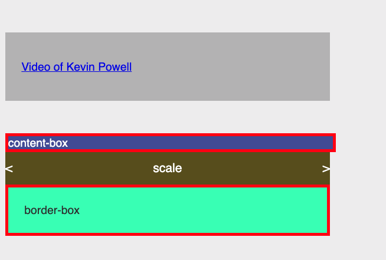

# CSS Notes

## Sources

- CSS in Depth, 2d Ed., Keith Grant (Manning 2024)
- Traversy CSS
- Kevin Powell (@KevinPowell)
- Schmedtmann CSS

---

## Topics

### Box Model

```html
<!DOCTYPE html>
<html lang="en">
  <head>
    <meta charset="UTF-8" />
    <meta name="viewport" content="width=device-width, initial-scale=1.0" />
    <title>html basics</title>
    <style>
      /*      *,
      *::before,
      *::after {
        box-sizing: border-box;
      }
 */
      *,
      *::before,
      *::after {
        box-sizing: inherit;
      }

      html {
        box-sizing: border-box;
      }

      body {
        background-color: #efefef;
        color: #333;
        font-family: basic-sans, sans-serif;
        font-size: 1.1rem;
      }

      .scale {
        box-sizing: border-box;
        width: 500px;
        height: 50px;
        color: white;
        background-color: #615716;
        font-size: 1.2rem;
        place-items: center;
        display: flex;
        justify-content: space-between;
      }

      .content-box {
        /* to see change now, use below and then comment out */
        box-sizing: content-box;
        width: 500px;
        background-color: #4b55a1;
        color: white;
        /* watch get wider */
        /* padding: 25px; */
        border: 5px solid red;
      }

      .border-box {
        width: 500px;
        background-color: #52ffb8;
        padding: 25px;
        border: 5px solid red;
      }

      .video {
        width: 500px;
        background-color: #bbb;
        padding: 25px;
        margin-block-start: 50px;
        margin-block-end: 50px;
      }
    </style>
  </head>
  <body>
    <div class="video">
      <p>
        <a href="https://www.youtube.com/watch?v=WlGQdgy-M6w&t=4s"
          >Video of Kevin Powell</a
        >
      </p>
    </div>
    <div class="content-box">content-box</div>
    <div class="scale">
      <span>&lt;</span>
      <span>scale</span>
      <span>&gt;</span>
    </div>
    <div class="border-box">border-box</div>
  </body>
</html>
```

Result:


